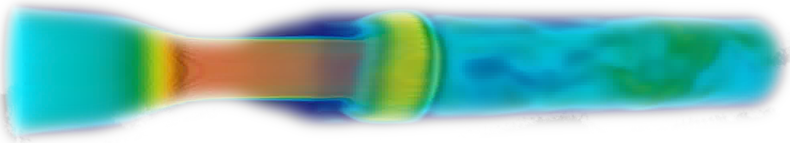
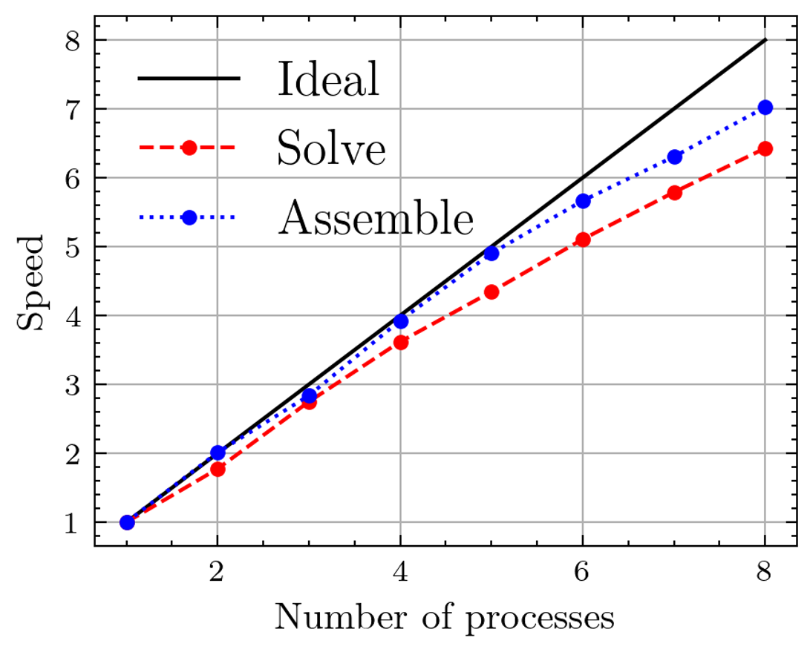

# FEM Parallel Fluid Analisis
## Overview
This code includes CFD solvers based on Message Passing Interface.  
The equations are discretized in orthogonal grid using Finite Element Method.  
## Dependencies
・metis: Domain partitioning (these sub domains are owned by each MPI process)  
・PETSc: MPI based library for soling matrix system  
・TextParser: Enables us to handle text parameter
## Usage
    * sh build.sh
    * cd /<example_dir>
    * mpirun -n <process> ./<solver_dir>/<solver_name> <tp_name>.tp petsc_options.dat
## Features
・SteadyStokesSolver: Steady Stokes Equation Solver  
・SteadyNavierStokesSolver: Steady Navier-Stokes Equation Solver  
・UnsteadyNavierStokesSolver: Unsteady Navier-Stokes Equation Solver  
## examples
Flow through a stenosed tube

MPI performance

